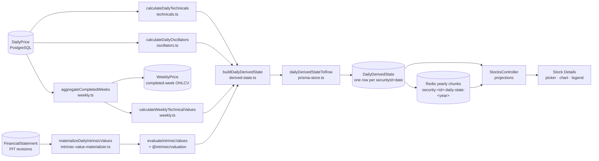
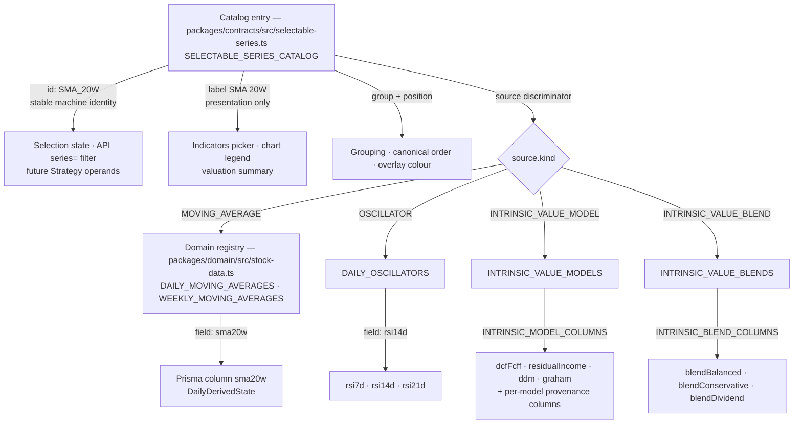
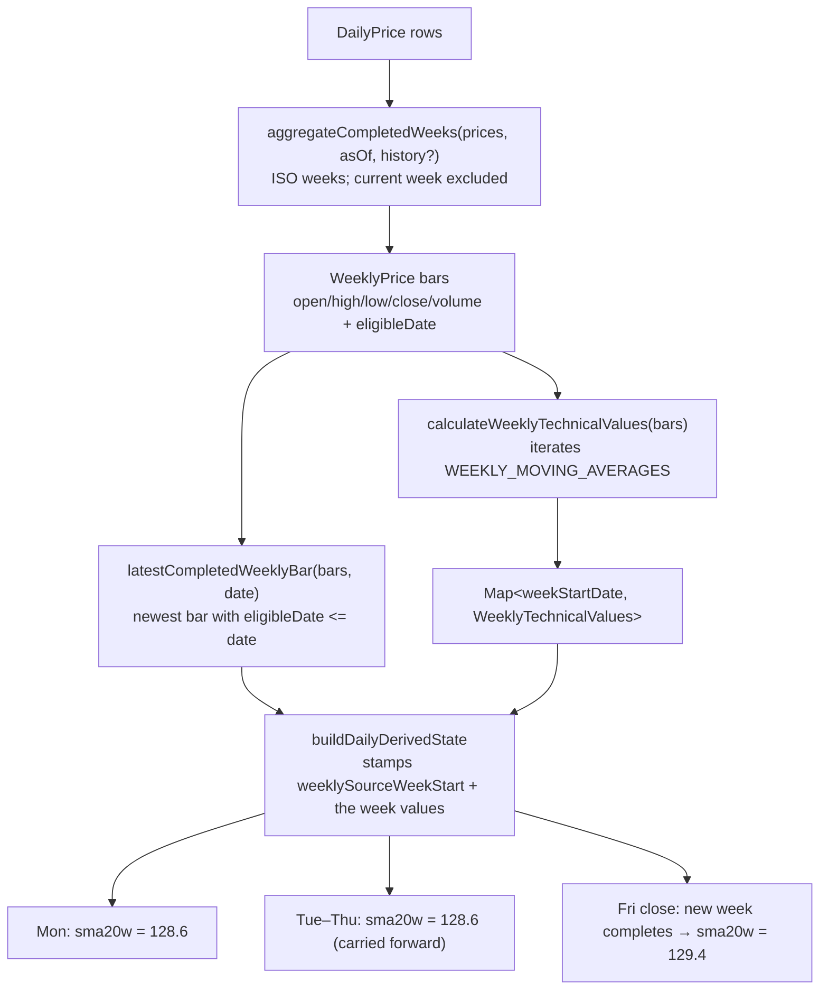

# Calculated Series

How calculated daily series are identified, calculated, persisted, cached, served and rendered —
as implemented today.

The storage model this describes is fixed by
`../../docs/decisions/retain-wide-column-calculated-series-storage.md` (Accepted). To add a series,
follow `../../docs/development/adding-a-calculated-series.md`. Product identities and ordering are
fixed by `../../docs/decisions/selectable-series-catalog.md`; point-in-time, completed-week and
provenance rules by `../../docs/decisions/stock-data-foundation.md` and
`../../docs/decisions/intrinsic-value-engine.md`.

## End-to-end flow

## Identity: catalog ID, label, storage field

Three separate concepts, related by convention and pinned by tests — never by parsing a string at
runtime.

- **Catalog ownership.** `packages/contracts/src/selectable-series.ts` owns the one product catalog:
  `SELECTABLE_SERIES_CATALOG`, its grouping (`SELECTABLE_SERIES_GROUPED`), its lookup
  (`findSelectableSeries`) and the consumer filters (`MOVING_AVERAGE_SERIES`,
  `INTRINSIC_VALUE_SERIES`, `comparableMovingAverages`, `INTRINSIC_VALUE_BLEND_OPTIONS`,
  `INTRINSIC_VALUE_MODEL_OPTIONS`). It lives in `@intrinsic/contracts` because that is the only
  package the web app may depend on, and it is equally available to the API and worker. **No
  feature keeps a second option, label or ordering list.**
- **Labels.** Each series has exactly **one** product label, used by the dropdown, the chart legend
  and the valuation summary alike. There is no shorter presentation variant: a `shortLabel`
  property existed briefly and was removed after browser measurement showed no need for it. At
  13px Geist the widest label, `"Dividend Discount (DDM)"`, measures 148px against 465px of
  available label width on desktop and 123px on a 390px phone, where it wraps to a second line in a
  `min-height: 44px` flex row with no truncation and no horizontal overflow. Ordering, grouping and
  identity are the catalog's; presentation width is CSS's problem.
- **Storage fields** carry an explicit timeframe suffix: `sma20d` and `rsi14d` from daily bars,
  `sma20w` from completed weekly bars. They never alias, and an ambiguous `sma20` or `rsi14` is
  forbidden.
- **An oscillator entry carries its product metadata structurally**: the `OSCILLATOR` source holds
  the family (`type: "RSI"`, which is also the pane-compatibility group), period, timeframe, field,
  the fixed `range` (`0-100`, pinned against the domain's `RSI_VALUE_RANGE` by the drift guard) and
  `placement: "SEPARATE_PANE"`. Default chart selection is catalog metadata too: entries opt in
  with `defaultSelected`, `DEFAULT_SELECTED_SERIES_IDS` derives the initial selection, and every
  oscillator starts off.

## Domain registries

`packages/domain/src/stock-data.ts` owns the identities that are calculated and persisted:

- `DAILY_MOVING_AVERAGES` — seven `{type, period, timeframe: "1D", field}` entries.
- `WEEKLY_MOVING_AVERAGES` — seven `{…, timeframe: "1W", field}` entries.
- `MATERIALIZED_MOVING_AVERAGES` — their concatenation, daily first, in registry order. That order
  is load-bearing: it is the order fields are written onto a row and the order the API projects
  them.
- `DAILY_OSCILLATORS` — three `{type: "RSI", period, timeframe: "1D", field}` entries (7/14/21),
  plus `RSI_VALUE_RANGE` (`{min: 0, max: 100}`), the fixed unit range the shared pane renders and
  future Strategy thresholds compare against.
- `TECHNICAL_SERIES_FIELDS` — every technical field in canonical wire order: moving averages
  (daily, then weekly) first, oscillators after them. The daily technical projection and the API
  both iterate this one list.
- `DailyMovingAverageField` / `WeeklyMovingAverageField` / `DailyOscillatorField` — the field-name
  types that make an unregistered field a compile error.
- `INTRINSIC_VALUE_MODELS`, `INTRINSIC_VALUE_BLEND_IDS`, `INTRINSIC_VALUE_BLENDS` (weights,
  versioned).

`apps/api/src/stocks/selectable-series-catalog.test.ts` is the drift guard between the catalog and
these registries.

## Daily calculation

`packages/stock-data/src/technicals.ts`:

- `movingAverage(values, type, period)` is the shared kernel for both timeframes. SMA warms up over
  `period` bars; EMA seeds from the first complete-window SMA and then applies
  `α = 2/(period + 1)`.
- `calculateDailyTechnicals(prices)` **iterates `DAILY_MOVING_AVERAGES`** and returns one row per
  trading day carrying `DailyTechnicalValues` (`Partial<Record<DailyMovingAverageField, number>>`).
  Adding a period to the registry materializes it without editing this function.
- Input is sorted internally, so ordering carries no information and a shuffled feed produces
  identical output.

## Daily oscillators — one Wilder RSI methodology

`packages/stock-data/src/oscillators.ts`:

- `calculateWilderRsi(closes, period)` is the one parameterized kernel; there is no per-period
  formula. `calculateDailyOscillators(prices)` iterates `DAILY_OSCILLATORS` over the same canonical
  completed daily closes the moving averages consume, so a period added to the registry is
  materialized without editing either function.
- **Formula, locked by `daily-oscillators.test.ts`:** consecutive close changes give
  `gain = max(change, 0)` and `loss = max(-change, 0)`. The first value appears once `period + 1`
  closes exist; its average gain/loss is the simple mean of the first `period` changes. Every later
  value applies Wilder smoothing — `avg' = (avg × (period − 1) + current) / period` — and
  `RSI = 100 × avgGain / (avgGain + avgLoss)`, algebraically `100 − 100 / (1 + RS)`.
- **Edge cases:** an only-gains window reads exactly 100, an only-losses window exactly 0, and a
  completely flat window (both averages zero) reads 50. Every value lies in `RSI_VALUE_RANGE`
  because both averages are non-negative.
- **Warm-up is absence.** `rsi7d` first appears on the eighth close, `rsi14d` on the fifteenth,
  `rsi21d` on the twenty-second — per period, never zero, never a shorter period standing in.
- **Trading observations are counted, not calendar days.** Weekend and holiday gaps between closes
  carry no meaning; the same close sequence produces the same values on any calendar, across year
  boundaries included.
- **No look-ahead.** A prefix of history yields identical values for its own days; the suite pins
  this alongside ordering independence and input purity (the caller's arrays are never mutated or
  reordered).
- The suite runs one behavioural matrix over all three registered periods, checks fixed
  independently calculated values (the period-14 fixture is the published Wilder worked example)
  and a structurally independent closed-form oracle, and locks the relative-sensitivity property:
  a shock moves RSI 7D further than RSI 14D and RSI 14D further than RSI 21D, in both directions.

## Weekly calculation — one production path

There is exactly **one** weekly path. `calculateWeeklyMovingAverage` and the `WeeklyTechnical` type
were the pre-catalog path and have been removed.

Rules, all test-locked in `packages/stock-data/src/weekly-technicals.test.ts`:

- **Completed weeks only.** The ISO week containing `asOf` is excluded — its final trading day is
  not yet known. `WEEKLY_TECHNICAL_BACKTEST_POLICY` in the domain is the published name for this.
- **Eligibility is the week's own last trading day's close** (`eligibleDate`), which handles
  holiday-shortened weeks. Earlier days of that week never see it.
- **Daily carry-forward.** The latest eligible weekly value is repeated on every later trading day
  until a newer completed week replaces it. Repetition is the data model, not duplication.
- **Never averages daily indicators.** Weekly values come from weekly closes.
- **Load boundary vs listing.** A first week truncated only by where the load target starts is
  dropped; a genuine mid-week IPO week is kept (`WeeklyHistoryContext`).
- **Warm-up.** Two hundred completed weeks is the longest lookback in the catalog, so it is what
  sets `DERIVED_SERIES_WARMUP_DAYS` — the history the loader materializes *before* a requested
  window so every series is already warmed up on its first visible day. It is derived from the
  registries, so adding a longer period widens it automatically.
- `WeeklyPrice` is persisted as completed-week OHLCV **source data**, not a derived-series value.
  It has no read port: every rebuild re-aggregates from canonical `DailyPrice`.

## Intrinsic-value models and blends

`packages/stock-data/src/intrinsic-value-materializer.ts` and `intrinsic-value-evaluator.ts`:

- `planIntrinsicEvaluationDates` computes evaluation events: the first trading day plus the
  effective trading day of each newly eligible `FinancialStatement` revision.
- `evaluateIntrinsicValues` assembles point-in-time inputs (`assembleIntrinsicValueInputs`), runs
  the pure formulas in `@intrinsic/valuation`, and combines blends through
  `combineBlendComponents` over `INTRINSIC_VALUE_BLENDS`. Weights are never renormalized and a
  missing component makes the blend unavailable.
- Between events the entire snapshot is **carried forward**. Carry-forward applies to
  unavailability too: a model invalidated at an event is absent from that day onward, never stale.
- **Provenance is per model** — `dcfFcffSourceAsOf`, `residualIncomeSourceAsOf`, `ddmSourceAsOf`,
  `grahamSourceAsOf`, mapped by `INTRINSIC_MODEL_SOURCE_FIELDS`. Blend provenance is **derived at
  read time** as the maximum of its required components (`blendSourceDataAsOf`), never stored.
- A row-level currency conflict materializes **no** intrinsic values for that day.

## Point-in-time invariants

- A value is only ever computed from information public by that trading day's cutoff.
- A model value is only readable together with **its own** provenance; a value without provenance
  is never returned (`toIntrinsicValuePoints` in `service.ts`).
- `asOf` is applied per model and per blend independently, so an earlier-sourced model is returned
  while a later-sourced one on the same row is withheld.
- Truncating future history must not change any already-materialized day. Both calculators have
  explicit no-lookahead prefix tests.
- Absent is absent: never zero, never back-filled before first eligibility.

## Persistence

`packages/database/prisma/schema.prisma`, model `DailyDerivedState`:

- Primary key `(securityId, date)`; **no secondary index** — the composite key already serves the
  only historical access pattern, `securityId + date range ascending`.
- 24 nullable `DECIMAL(20,8)` value columns: 7 daily MAs, 7 weekly MAs, 3 daily RSI oscillators,
  4 intrinsic models, 3 blends. Plus `weeklySourceWeekStart`, four provenance timestamps and
  `intrinsicCurrency`.
- No calculation-version column, ever.

`packages/stock-data/src/prisma-store.ts` maps in three hand-written places —
`DailyDerivedStateRow`, `dailyDerivedStateFromRow`, `dailyDerivedStateToRow` — plus the
`INTRINSIC_MODEL_COLUMNS`, `INTRINSIC_MODEL_SOURCE_COLUMNS` and `INTRINSIC_BLEND_COLUMNS` maps.
This duplication is the accepted cost of the wide-column model; it is guarded by completeness
tests rather than by discipline. `saveDailyDerivedState` deletes and re-creates the affected days
inside one transaction under a per-security advisory lock: replace, never version.

## Revision and lazy rebuild

`DERIVED_STATE_REVISION` (`packages/stock-data/src/derived-state.ts`, currently **4**) is a
methodology rebuild trigger, never a row-identity or history dimension. It is recorded only in the
dataset-state/coverage variant (`daily-derived-state:r4`) and in the Redis manifest. r4 added the
daily RSI family — one bump for all three periods, because an r3 row's NULL oscillator columns are
indistinguishable from warm-up.

Bumping it makes previous-variant coverage and manifests report nothing, so
`CanonicalStockDataService` recalculates and **replaces** the affected rows on next access. It is
**global**: a bump for one series invalidates every series for every security, and the rebuild is
lazy. That limitation is accepted and recorded in the storage decision; per-family revisions are
deferred.

## Redis (v2)

`packages/stock-data/src/cache.ts`:

- Key family `stock-data:v2:security:<securityId>:daily-state:<year>` — **one chunk family for the
  whole derived state**; never a key per indicator, model or blend.
- Each chunk is a JSON array of **row-oriented** `DailyDerivedState` objects, so field names repeat
  per row (measured: ~56 % of a serialized row is names and syntax).
- The manifest carries `derivedStateRevision`; `isReady` rejects a manifest whose revision differs
  from the current one, forcing rehydration.
- Complete-stock LRU: every key belonging to a security is registered so eviction removes all of
  its datasets together. Redis is disposable — a flush costs latency, never data.
- A partial rebuild republishes **complete** affected years, because a yearly chunk is replaced
  wholesale.

## API

`apps/api/src/stocks/stocks.controller.ts`:

| Route | Projection |
| --- | --- |
| `GET /stocks/:symbol` | composite Stock Details for a bounded window |
| `GET /stocks/:symbol/prices` | `DailyPriceResponse[]` |
| `GET /stocks/:symbol/technicals/daily` | `DailyTechnicalResponse[]`, all 14 MAs + 3 RSI; `series=` narrows |
| `GET /stocks/:symbol/intrinsic-values` | long-form points; `models=`, `asOf=` |
| `GET /stocks/:symbol/intrinsic-value-blends` | long-form points; `blendIds=`, `asOf=` |

- `technicalResponse` projects `TECHNICAL_SERIES_FIELDS` — every moving average and every daily
  oscillator — so a registered series cannot go missing from the API.
- `technicalFields` resolves `series=` against the catalog via `findSelectableSeries` and rejects
  anything that is not a moving-average or oscillator entry (`TECHNICAL_SERIES` is the addressable
  set the validation error names). Filtering happens **after** retrieval, on the full daily row.
- Unavailable values are **omitted**, never `null` and never zero.
- Controllers project canonical stock-data values; they never calculate.

## Web

`apps/web/src/features/stocks/details/`:

- `utils/series-catalog.ts` — `seriesPoints` switches on `source.kind` (the one dispatch point;
  moving averages and oscillators both read technical rows), `availableSeriesIds` answers
  availability from the always-loaded details window — per period, so a leading warm-up gap does
  not disable a series whose later points are evaluable — and `buildOverlays` emits overlays in
  canonical catalog order, each carrying its placement (`PRICE_OVERLAY` or `OSCILLATOR_PANE`) and,
  for oscillators, the catalog's fixed scale.
- `components/IndicatorsMenu.tsx` — grouped multi-select built entirely from
  `SELECTABLE_SERIES_GROUPED`. Every catalog entry stays discoverable; one the security has no data
  for is rendered **disabled and marked "Unavailable"**, never hidden and never substituted.
- `hooks/use-indicator-selection.ts` — presentation state only; an unavailable entry can never
  enter the selection.
- `utils/chart-theme.ts` — `overlayColorAt` assigns colour by position within the enabled set,
  spanning both panes so simultaneously enabled series stay distinct. Colour is deliberately
  **not** part of series identity.
- `utils/valuation.ts` — the summary derives identities, ordering and labels from
  `INTRINSIC_VALUE_BLEND_OPTIONS` / `INTRINSIC_VALUE_MODEL_OPTIONS`.
- Price-scaled catalog series are drawn as **overlays on the price chart**. Oscillators are
  **never** drawn over the price scale: `StockPriceChart` routes them into one shared native
  Lightweight Charts pane (`paneIndex 1` of the same chart instance), so every selected RSI period
  shares one fixed `0-100` axis, one muted dashed set of 30/50/70 reference levels (Oversold 30 /
  50 / Overbought 70, owned by the canonically first oscillator series and moving with it), and the
  price chart's time scale and crosshair by construction. The first selected oscillator creates the
  pane, removing the last one removes it, and repeated toggling reuses the same pane index — no
  duplicated panes, lines, levels or subscriptions, pinned by a toggle-cycle test. The hover legend
  renders oscillator readings unitless (one decimal) beside money-formatted price overlays, and the
  chart wrapper grows while the pane exists so the price pane keeps a useful height on desktop and
  phone.

## Availability and warm-up

Absence is the single representation of "no value", at every layer: `NULL` in PostgreSQL, an
omitted key in the domain object, the cache and the API, and a disabled option in the picker.

A present `weeklySourceWeekStart` with absent weekly values is the precise "a completed week
exists, but this indicator has not warmed up yet" state.

## Currently collapsed NOT_EVALUABLE reasons

The evaluator distinguishes why a model produced nothing — `EvaluatedIntrinsicModel` carries
`phase: "ASSEMBLY" | "VALUATION"` plus a code from `IntrinsicValueAssemblyReason` (5 codes) or
`VALUATION_NOT_APPLICABLE_REASONS` (12 codes). `toSnapshot` collapses all of them to field absence
before persistence.

So storage cannot today distinguish insufficient warm-up, not-yet-eligible, not-applicable,
invalidated-by-a-later-revision, or a currency-conflict day. Only the currency conflict is
surfaced at all, as an observability event. Whether Strategy's `NOT_EVALUABLE` needs these
persisted is a deferred decision recorded in the storage ADR.

## Future Strategy and backtest boundaries

Not implemented; noted so the boundary is not accidentally crossed:

- Strategy conditions will reference **catalog IDs** (`SelectableSeriesId`) as stable operands.
  `comparableMovingAverages` already encodes the same-timeframe, not-itself rule.
- `apps/worker` is a foundation process with no job processors. When backtests land they must
  consume `@intrinsic/stock-data`, not reimplement loading.
- Every read port is currently single-security (`symbol`/`securityId` + range). A multi-security
  bulk read does not exist yet.
- `maximumPositions` belongs to a Backtest execution, not a Strategy.

## Extension points for a new series family

The exact checklist is `../../docs/development/adding-a-calculated-series.md`. The structural
points a *new family* touches, beyond a new period in an existing one:

1. A new `SelectableSeriesSource` kind in the catalog — parameters belong in the structured source,
   never parsed from the id.
2. `MovingAverageFieldResponse` in `packages/contracts/src/stock-data.ts`, derived from the
   moving-average slice (`MovingAverageValuesResponse`) of `DailyTechnicalResponse`;
   `OscillatorValuesResponse` and `TechnicalSeriesFieldResponse` sit beside it. A new family adds
   its own slice rather than widening an existing field union.
3. A registry plus a calculator that iterates it, returning `Partial<Record<Field, number>>`.
4. `buildDailyDerivedState` — merge the family by exact trading date.
5. `technicalResponse` and `technicalFields` in the controller.
6. The `seriesPoints` switch in `utils/series-catalog.ts` (exhaustive, so TypeScript points at it).
7. A separate chart pane if the family is not price-scaled.

## Deferred / Future — not implemented

Explicitly **not** the current architecture. Do not describe any of these as implemented:

- **JSONB** value/provenance maps — deferred, with triggers and budgets in
  `../../docs/decisions/retain-wide-column-calculated-series-storage.md`.
- **Redis v3 / column-oriented chunks** — a dates array plus per-series aligned arrays would cut
  the measured field-name overhead, and is the cheaper intervention if the series count approaches
  the top of the accepted range. Not built.
- **A generic `/series` projection endpoint** taking arbitrary catalog IDs. Not built; today the
  web client fetches all series and filters client-side.
- **Per-family or per-series revisions** replacing the single global `DERIVED_STATE_REVISION`.
- **Persisted NOT_EVALUABLE reasons.**
- **MACD, growth rates, quality metrics, volatility, ratios** — no such series exists. (The daily
  RSI family is implemented; it is the first oscillator, not a template for storing multi-output
  families like MACD, which still needs the explicit product decision described above.)
