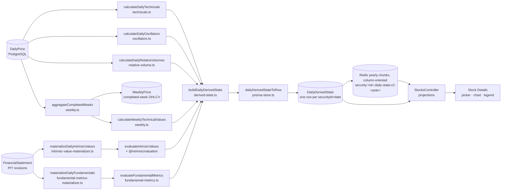
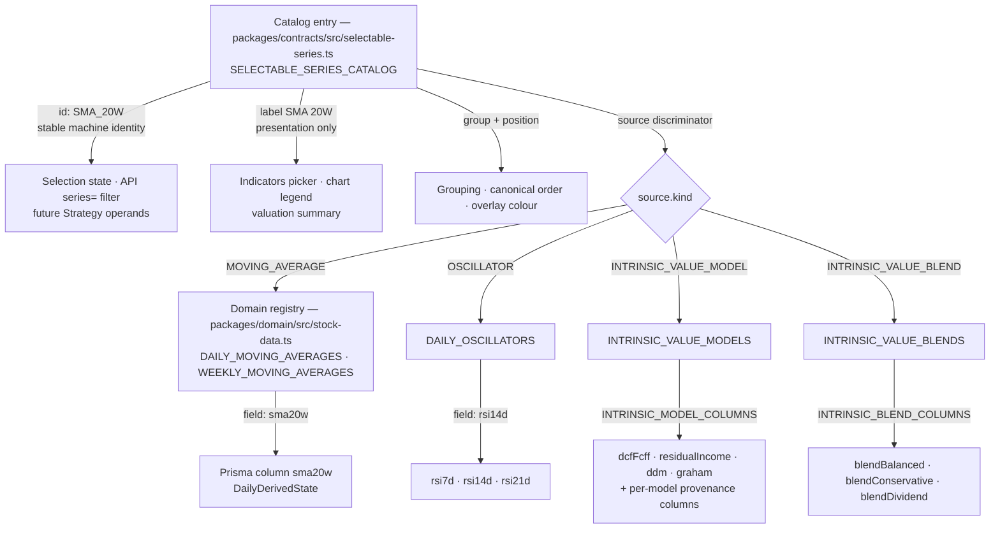
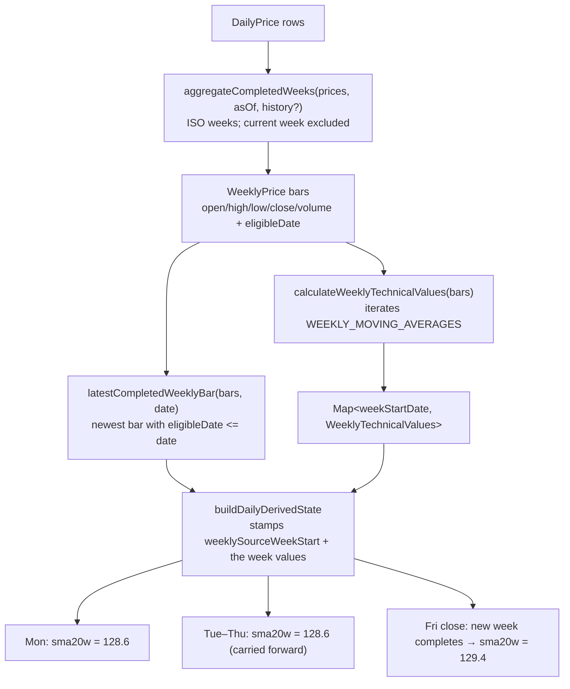

# Calculated Series

How calculated daily series are identified, calculated, persisted, cached, served and rendered —
as implemented today.

The storage model this describes is fixed by
`../../docs/decisions/retain-wide-column-calculated-series-storage.md` (Accepted). To add a series,
follow `../../docs/development/adding-a-calculated-series.md`. Product identities and ordering are
fixed by `../../docs/decisions/selectable-series-catalog.md`; point-in-time, completed-week and
provenance rules by `../../docs/decisions/stock-data-foundation.md` and
`../../docs/decisions/intrinsic-value-engine.md`.

## End-to-end flow

```mermaid
flowchart LR
  DP[("DailyPrice<br/>PostgreSQL")] --> DT["calculateDailyTechnicals<br/>technicals.ts"]
  DP --> DO["calculateDailyOscillators<br/>oscillators.ts"]
  DP --> RV["calculateDailyRelativeVolumes<br/>relative-volume.ts"]
  DP --> AW["aggregateCompletedWeeks<br/>weekly.ts"]
  AW --> WP[("WeeklyPrice<br/>completed-week OHLCV")]
  AW --> WV["calculateWeeklyTechnicalValues<br/>weekly.ts"]
  FS[("FinancialStatement<br/>PIT revisions")] --> IM["materializeDailyIntrinsicValues<br/>intrinsic-value-materializer.ts"]
  IM --> EV["evaluateIntrinsicValues<br/>+ @intrinsic/valuation"]
  FS --> FM["materializeDailyFundamentals<br/>fundamental-metrics-materializer.ts"]
  FM --> FE["evaluateFundamentalMetrics<br/>fundamental-metrics.ts"]
  DT --> BD["buildDailyDerivedState<br/>derived-state.ts"]
  FE --> BD
  DO --> BD
  RV --> BD
  WV --> BD
  EV --> BD
  BD --> ST["dailyDerivedStateToRow<br/>prisma-store.ts"]
  ST --> PG[("DailyDerivedState<br/>one row per securityId+date")]
  PG --> RD[("Redis yearly chunks, column-oriented<br/>security:&lt;id&gt;:daily-state:v2:&lt;year&gt;")]
  PG --> API["StocksController<br/>projections"]
  RD --> API
  API --> WEB["Stock Details<br/>picker · chart · legend"]
```

## Identity: catalog ID, label, storage field

Three separate concepts, related by convention and pinned by tests — never by parsing a string at
runtime.

```mermaid
flowchart TD
  C["Catalog entry — packages/contracts/src/selectable-series.ts<br/>SELECTABLE_SERIES_CATALOG"]
  C -->|"id: SMA_20W<br/>stable machine identity"| SEL["Selection state · API series= filter<br/>future Strategy operands"]
  C -->|"label SMA 20W<br/>presentation only"| UI["Indicators picker · chart legend<br/>valuation summary"]
  C -->|"group + position"| ORD["Grouping · canonical order · overlay colour"]
  C -->|"source discriminator"| SRC{"source.kind"}
  SRC -->|MOVING_AVERAGE| REG["Domain registry — packages/domain/src/stock-data.ts<br/>DAILY_MOVING_AVERAGES · WEEKLY_MOVING_AVERAGES"]
  SRC -->|OSCILLATOR| OSC["DAILY_OSCILLATORS"]
  SRC -->|INTRINSIC_VALUE_MODEL| IVM["INTRINSIC_VALUE_MODELS"]
  SRC -->|INTRINSIC_VALUE_BLEND| IVB["INTRINSIC_VALUE_BLENDS"]
  REG -->|"field: sma20w"| COL["Prisma column sma20w<br/>DailyDerivedState"]
  OSC -->|"field: rsi14d"| COL4["rsi7d · rsi14d · rsi21d"]
  IVM -->|"INTRINSIC_MODEL_COLUMNS"| COL2["dcfFcff · residualIncome · ddm · graham<br/>+ per-model provenance columns"]
  IVB -->|"INTRINSIC_BLEND_COLUMNS"| COL3["blendBalanced · blendConservative · blendDividend"]
```

- **Catalog ownership.** `packages/contracts/src/selectable-series.ts` owns the one product catalog:
  `SELECTABLE_SERIES_CATALOG`, its grouping (`SELECTABLE_SERIES_GROUPED`), its lookup
  (`findSelectableSeries`) and the consumer filters (`MOVING_AVERAGE_SERIES`,
  `INTRINSIC_VALUE_SERIES`, `comparableMovingAverages`, `INTRINSIC_VALUE_BLEND_OPTIONS`,
  `INTRINSIC_VALUE_MODEL_OPTIONS`). It lives in `@intrinsic/contracts` because that is the only
  package the web app may depend on, and it is equally available to the API and worker. **No
  feature keeps a second option, label or ordering list.**
- **Labels.** Each series has exactly **one** product label, used by the dropdown, the chart legend
  and the valuation summary alike. There is no shorter presentation variant: a `shortLabel`
  property existed briefly and was removed after browser measurement showed no need for it. At
  13px Geist the widest label, `"Dividend Discount (DDM)"`, measures 148px against 465px of
  available label width on desktop and 123px on a 390px phone, where it wraps to a second line in a
  `min-height: 44px` flex row with no truncation and no horizontal overflow. Ordering, grouping and
  identity are the catalog's; presentation width is CSS's problem.
- **Storage fields** carry an explicit timeframe suffix: `sma20d` and `rsi14d` from daily bars,
  `sma20w` from completed weekly bars. They never alias, and an ambiguous `sma20` or `rsi14` is
  forbidden.
- **An oscillator entry carries its product metadata structurally**: the `OSCILLATOR` source holds
  the family (`type: "RSI"`, which is also the pane-compatibility group), period, timeframe, field,
  the fixed `range` (`0-100`, pinned against the domain's `RSI_VALUE_RANGE` by the drift guard) and
  `placement: "SEPARATE_PANE"`. Default chart selection is catalog metadata too: entries opt in
  with `defaultSelected`, `DEFAULT_SELECTED_SERIES_IDS` derives the initial selection, and every
  oscillator starts off.

## Domain registries

`packages/domain/src/stock-data.ts` owns the identities that are calculated and persisted:

- `DAILY_MOVING_AVERAGES` — seven `{type, period, timeframe: "1D", field}` entries.
- `WEEKLY_MOVING_AVERAGES` — seven `{…, timeframe: "1W", field}` entries.
- `MATERIALIZED_MOVING_AVERAGES` — their concatenation, daily first, in registry order. That order
  is load-bearing: it is the order fields are written onto a row and the order the API projects
  them.
- `DAILY_OSCILLATORS` — three `{type: "RSI", period, timeframe: "1D", field}` entries (7/14/21),
  plus `RSI_VALUE_RANGE` (`{min: 0, max: 100}`), the fixed unit range the shared pane renders and
  future Strategy thresholds compare against.
- `DAILY_RELATIVE_VOLUMES` — three `{period, timeframe: "1D", field}` entries (10/20/50), plus
  `RELATIVE_VOLUME_PERIODS`, `RELATIVE_VOLUME_FIELDS` and `relativeVolumeDefinition(period)`, the
  one lookup from a product period to its column. It is **not** a catalog family.
- `TECHNICAL_SERIES_FIELDS` — every *catalog* technical field in canonical wire order: moving
  averages (daily, then weekly) first, oscillators after them. It is the set the `series=` filter
  addresses. `DAILY_TECHNICAL_PROJECTION_FIELDS` appends Relative Volume to it, and is what the
  daily technical projection and the API iterate.
- `DailyMovingAverageField` / `WeeklyMovingAverageField` / `DailyOscillatorField` /
  `DailyRelativeVolumeField` — the field-name types that make an unregistered field a compile
  error.
- `INTRINSIC_VALUE_MODELS`, `INTRINSIC_VALUE_BLEND_IDS`, `INTRINSIC_VALUE_BLENDS` (weights,
  versioned).
- `FUNDAMENTAL_METRICS` (`packages/domain/src/fundamental-metrics.ts`) — the fifteen Fundamental
  Metrics V1, each `{id, field, unit}`: stable identity (`ROIC_TTM`), `DailyDerivedState` field
  (`roicTtm`) and unit (`PERCENT` in percentage points, or `MULTIPLE`). `FUNDAMENTAL_METRIC_FIELDS`
  and `FundamentalMetricField` follow it. It carries no label or group: those belong to the product
  catalog, `FUNDAMENTAL_METRIC_CATALOG` in `@intrinsic/contracts` (label, group, canonical order,
  threshold floor, help), and `packages/stock-data/src/fundamental-metrics-catalog.test.ts` is the
  drift guard between the two.

`apps/api/src/stocks/selectable-series-catalog.test.ts` is the drift guard between the catalog and
these registries.

## Daily calculation

`packages/stock-data/src/technicals.ts`:

- `movingAverage(values, type, period)` is the shared kernel for both timeframes. SMA warms up over
  `period` bars; EMA seeds from the first complete-window SMA and then applies
  `α = 2/(period + 1)`.
- `calculateDailyTechnicals(prices)` **iterates `DAILY_MOVING_AVERAGES`** and returns one row per
  trading day carrying `DailyTechnicalValues` (`Partial<Record<DailyMovingAverageField, number>>`).
  Adding a period to the registry materializes it without editing this function.
- Input is sorted internally, so ordering carries no information and a shuffled feed produces
  identical output.

## Daily oscillators — one Wilder RSI methodology

`packages/stock-data/src/oscillators.ts`:

- `calculateWilderRsi(closes, period)` is the one parameterized kernel; there is no per-period
  formula. `calculateDailyOscillators(prices)` iterates `DAILY_OSCILLATORS` over the same canonical
  completed daily closes the moving averages consume, so a period added to the registry is
  materialized without editing either function.
- **Formula, locked by `daily-oscillators.test.ts`:** consecutive close changes give
  `gain = max(change, 0)` and `loss = max(-change, 0)`. The first value appears once `period + 1`
  closes exist; its average gain/loss is the simple mean of the first `period` changes. Every later
  value applies Wilder smoothing — `avg' = (avg × (period − 1) + current) / period` — and
  `RSI = 100 × avgGain / (avgGain + avgLoss)`, algebraically `100 − 100 / (1 + RS)`.
- **Edge cases:** an only-gains window reads exactly 100, an only-losses window exactly 0, and a
  completely flat window (both averages zero) reads 50. Every value lies in `RSI_VALUE_RANGE`
  because both averages are non-negative.
- **Warm-up is absence.** `rsi7d` first appears on the eighth close, `rsi14d` on the fifteenth,
  `rsi21d` on the twenty-second — per period, never zero, never a shorter period standing in.
- **Trading observations are counted, not calendar days.** Weekend and holiday gaps between closes
  carry no meaning; the same close sequence produces the same values on any calendar, across year
  boundaries included.
- **No look-ahead.** A prefix of history yields identical values for its own days; the suite pins
  this alongside ordering independence and input purity (the caller's arrays are never mutated or
  reordered).
- The suite runs one behavioural matrix over all three registered periods, checks fixed
  independently calculated values (the period-14 fixture is the published Wilder worked example)
  and a structurally independent closed-form oracle, and locks the relative-sensitivity property:
  a shock moves RSI 7D further than RSI 14D and RSI 14D further than RSI 21D, in both directions.

## Weekly calculation — one production path

There is exactly **one** weekly path. `calculateWeeklyMovingAverage` and the `WeeklyTechnical` type
were the pre-catalog path and have been removed.

```mermaid
flowchart TD
  DP["DailyPrice rows"] --> AGG["aggregateCompletedWeeks(prices, asOf, history?)<br/>ISO weeks; current week excluded"]
  AGG --> BARS["WeeklyPrice bars<br/>open/high/low/close/volume + eligibleDate"]
  BARS --> CALC["calculateWeeklyTechnicalValues(bars)<br/>iterates WEEKLY_MOVING_AVERAGES"]
  CALC --> MAP["Map&lt;weekStartDate, WeeklyTechnicalValues&gt;"]
  BARS --> LATEST["latestCompletedWeeklyBar(bars, date)<br/>newest bar with eligibleDate &lt;= date"]
  LATEST --> ROW
  MAP --> ROW["buildDailyDerivedState<br/>stamps weeklySourceWeekStart + the week values"]
  ROW --> D1["Mon: sma20w = 128.6"]
  ROW --> D2["Tue–Thu: sma20w = 128.6 (carried forward)"]
  ROW --> D3["Fri close: new week completes → sma20w = 129.4"]
```

Rules, all test-locked in `packages/stock-data/src/weekly-technicals.test.ts`:

- **Completed weeks only.** The ISO week containing `asOf` is excluded — its final trading day is
  not yet known. `WEEKLY_TECHNICAL_BACKTEST_POLICY` in the domain is the published name for this.
- **Eligibility is the week's own last trading day's close** (`eligibleDate`), which handles
  holiday-shortened weeks. Earlier days of that week never see it.
- **Daily carry-forward.** The latest eligible weekly value is repeated on every later trading day
  until a newer completed week replaces it. Repetition is the data model, not duplication.
- **Never averages daily indicators.** Weekly values come from weekly closes.
- **Load boundary vs listing.** A first week truncated only by where the load target starts is
  dropped; a genuine mid-week IPO week is kept (`WeeklyHistoryContext`).
- **Warm-up.** Two hundred completed weeks is the longest lookback in the catalog, so it is what
  sets `DERIVED_SERIES_WARMUP_DAYS` — the history the loader materializes _before_ a requested
  window so every series is already warmed up on its first visible day. It is derived from the
  registries, so adding a longer period widens it automatically. It also sets
  `PRICE_RETENTION_WARMUP_YEARS`, the four internal years of raw price history retained _behind_
  the 30-year product horizon so the same guarantee holds at the boundary itself — where the
  clamp used to cancel the warm-up out (`../../docs/decisions/price-retention-warmup-horizon.md`).
- `WeeklyPrice` is persisted as completed-week OHLCV **source data**, not a derived-series value.
  It has no read port: every rebuild re-aggregates from canonical `DailyPrice`.

## Relative Volume — one window methodology

`packages/stock-data/src/relative-volume.ts`:

- `calculateRelativeVolume(volumes, period)` is the one parameterized kernel; there is no
  per-period formula. `calculateDailyRelativeVolumes(prices)` iterates `DAILY_RELATIVE_VOLUMES`
  over the **volume column of the same canonical daily bars** the moving averages read their closes
  from, so a period added to the registry is materialized without editing either function. **No FMP
  request is involved**: volume has always been part of the historical EOD payload and of
  `DailyPrice`.
- **Formula, locked by `relative-volume.test.ts`:**
  `RVOL(p)(t) = volume(t) / mean(volume(t - p) … volume(t - 1))`. The session being measured is
  **never part of its own baseline**, and the full lookback is required — `rvol10` first appears on
  the eleventh session, `rvol20` on the twenty-first, `rvol50` on the fifty-first.
- **Edge cases:** a zero baseline leaves the value absent, because the ratio is undefined there and
  an infinity would satisfy every threshold a Strategy could name. A session whose volume is not a
  finite number has no value of its own and none of the later sessions whose window contains it
  does either. `RVOL = 0` is a real reading — a session that traded nothing — and is never a
  stand-in for absence.
- **Trading observations are counted, not calendar days**, and the calculation is linear: one
  rolling sum plus a rolling count of unusable observations inside the window, per period.
- It is **not** a selectable-series catalog entry. It is never a chart overlay and never a Strategy
  `Value`, so it is addressed by *period* — the same choice `Price`, `Gain` and `Loss` make in
  being metrics without catalog ids. `apps/api/src/stocks/selectable-series-catalog.test.ts` pins
  the contracts period list against the domain registry.

## Intrinsic-value models and blends

`packages/stock-data/src/intrinsic-value-materializer.ts` and `intrinsic-value-evaluator.ts`:

- `planIntrinsicEvaluationDates` computes evaluation events: the first trading day plus the
  effective trading day of each newly eligible `FinancialStatement` revision.
- `evaluateIntrinsicValues` assembles point-in-time inputs (`assembleIntrinsicValueInputs`), runs
  the pure formulas in `@intrinsic/valuation`, and combines blends through
  `combineBlendComponents` over `INTRINSIC_VALUE_BLENDS`. Weights are never renormalized and a
  missing component makes the blend unavailable.
- Between events the entire snapshot is **carried forward**. Carry-forward applies to
  unavailability too: a model invalidated at an event is absent from that day onward, never stale.
- **Provenance is per model** — `dcfFcffSourceAsOf`, `residualIncomeSourceAsOf`, `ddmSourceAsOf`,
  `grahamSourceAsOf`, mapped by `INTRINSIC_MODEL_SOURCE_FIELDS`. Blend provenance is **derived at
  read time** as the maximum of its required components (`blendSourceDataAsOf`), never stored.
- A row-level currency conflict materializes **no** intrinsic values for that day.

## Fundamental Metrics

`docs/decisions/fundamental-metrics-v1.md` fixes the formulas and
`docs/decisions/fundamental-metrics-storage-and-evaluation.md` how they are stored. Implemented in
`packages/stock-data/src/`:

- `fiscal-quarters.ts` — the one definition of fiscal-quarter identity (`(fiscalYear, period)`,
  never calendar position), adjacency and exact windows: four-quarter TTM, eight-quarter YoY
  chains, the aligned cross-family window ending at the newest quarter any family holds, opening
  and ending states aligned to a flow window, and the latest independent state. Fundamental Metrics
  anchor every window at the newest quarter they are evaluated for: a gap, or a family that lags or
  stopped reporting, makes the window unavailable rather than falling back to an older one, and an
  `FY` row is never a quarter. Intrinsic-value input assembly uses the same helpers but anchors its
  cross-family windows at the latest quarter both families hold (`latestCommonFiscalQuarterRank`).
- `fundamental-metrics.ts` — `evaluateFundamentalMetrics` selects the point-in-time quarterly
  revisions for one trading day and runs the fifteen kernels. Sums are exact sums of the reported
  decimals (`exact-decimal-sum.ts`), so a rule such as `require EPS_TTM > 0` is decided on the
  true sign rather than on binary residue. A metric is unavailable when the statements it read do
  not share one reported currency, or when its result is not finite or not storable in the
  calculated-series range (`isRepresentableCalculatedSeriesValue`, `DECIMAL(20,8)`); absence is
  the only "unavailable".
- `statement-events.ts` — the event plan shared with intrinsic values: the first trading day plus
  the first session on or after each revision's `availableFromDate`.
  `materializeDailyFundamentals` evaluates all fifteen once per event and carries the snapshot,
  absence included, forward to every later session until the next event.
- `CanonicalStockDataService.rebuildDailyDerivedState` reads the retained revisions once and feeds
  the same set to both statement-derived materializers, so a revision moves intrinsic values and
  Fundamental Metrics on the same session in the same write. There is no fundamentals-specific
  rebuild, cache key or table.
- No provenance column: the materializer guarantees point-in-time eligibility by construction, and
  the storage decision fixes exactly fifteen value columns. Consequently a chart tooltip can name a
  metric's session and value but not its TTM end or its statement's availability date; exposing
  those would need persisted provenance, which is deferred.
- Stock Details reads them through `getDailyFundamentalMetric` (API below) and draws one at a time
  (Web below). The Strategy evaluation frame and the chart read the same rows, and
  `packages/stock-data/src/fundamental-history.integration.test.ts` proves they agree on every
  session.

## Point-in-time invariants

- A value is only ever computed from information public by that trading day's cutoff.
- A model value is only readable together with **its own** provenance; a value without provenance
  is never returned (`toIntrinsicValuePoints` in `service.ts`).
- `asOf` is applied per model and per blend independently, so an earlier-sourced model is returned
  while a later-sourced one on the same row is withheld.
- Truncating future history must not change any already-materialized day. Both calculators have
  explicit no-lookahead prefix tests.
- Absent is absent: never zero, never back-filled before first eligibility.

## Persistence

`packages/database/prisma/schema.prisma`, model `DailyDerivedState`:

- Primary key `(securityId, date)`; **no secondary index** — the composite key already serves the
  only historical access pattern, `securityId + date range ascending`.
- 42 nullable `DECIMAL(20,8)` value columns: 7 daily MAs, 7 weekly MAs, 3 daily RSI oscillators,
  3 Relative Volume periods, 15 Fundamental Metrics, 4 intrinsic models, 3 blends. Plus
  `weeklySourceWeekStart`, four provenance timestamps and `intrinsicCurrency`.
- No calculation-version column, ever.

`packages/stock-data/src/prisma-store.ts` maps in three hand-written places —
`DailyDerivedStateRow`, `dailyDerivedStateFromRow`, `dailyDerivedStateToRow` — plus the
`INTRINSIC_MODEL_COLUMNS`, `INTRINSIC_MODEL_SOURCE_COLUMNS` and `INTRINSIC_BLEND_COLUMNS` maps.
The Fundamental Metrics share their field names with their columns, so they are mapped by
iterating `FUNDAMENTAL_METRIC_FIELDS`, with the row type keyed by `FundamentalMetricField` so a
registered metric without a Prisma column is a compile error. A non-finite fundamental value is
refused rather than written: Prisma persists `Infinity`/`NaN` in a `Decimal` column as `NULL`,
which would silently turn a defect into "unavailable"; a finite value outside `DECIMAL(20,8)` is
refused by PostgreSQL. The calculation produces neither — it reports such a metric unavailable
for that observation — so these refusals only guard against a defect; an extreme ratio never
fails a rebuild. This duplication is the accepted cost of the wide-column model; it is
guarded by completeness tests rather than by discipline. `saveDailyDerivedState` deletes and re-creates the affected days
inside one transaction under a per-security advisory lock: replace, never version.

## Revision and lazy rebuild

`DERIVED_STATE_REVISION` (`packages/stock-data/src/derived-state.ts`, currently **7**) is a
methodology rebuild trigger, never a row-identity or history dimension. It is recorded only in the
dataset-state/coverage variant (`daily-derived-state:r7`) and in the Redis manifest. r4 added the
daily RSI family — one bump for all three periods, because an r3 row's NULL oscillator columns are
indistinguishable from warm-up. r6 added the Relative Volume family and r7 the fifteen Fundamental
Metrics, for the same reason.

**A corrected historical volume needs no separate mechanism.** Changing `volume` at session `T`
moves every later session whose baseline window contains `T` — the next 10, 20 or 50 sessions
depending on the period. The existing rebuild already spans exactly that: `rebuildDailyDerivedState`
recalculates from the security's earliest persisted bar and *replaces* the affected days, and a
backfill reports the earliest changed date, which is where the rebuild starts. There is no RVOL
correction path, and there must not be one.

Bumping it makes previous-variant coverage and manifests report nothing, so
`CanonicalStockDataService` recalculates and **replaces** the affected rows on next access. It is
**global**: a bump for one series invalidates every series for every security, and the rebuild is
lazy. That limitation is accepted and recorded in the storage decision; per-family revisions are
deferred.

## Redis (v2 namespace, column-oriented chunks)

`packages/stock-data/src/cache.ts` stores the chunks; `packages/stock-data/src/daily-state-chunk.ts`
is the one codec that spells them. The decision, its measurements and the alternatives are in the
storage decision's "Redis chunk layout" section.

- Key family `stock-data:v2:security:<securityId>:daily-state:v2:<year>` (`dailyStateChunkKey`) —
  **one chunk per security and calendar year for the whole derived state**; never a key per
  indicator, model, blend or metric. The `v2` segment is the chunk encoding, like the `v1` in a
  statement key.
- Each chunk is **column-oriented**: a header (`version`, `securityId`, `year`), the field
  dictionary, one ascending date axis, and one run-length column per field. A cell is a value for
  one session, `[value, count]` for a repeated value, or `[count]` for sessions without one —
  absence is a count, never `null` and never zero. Columns come from the registries in the key order
  `dailyDerivedStateFromRow` writes, so a decoded row serializes byte for byte like PostgreSQL's.
  The carried-forward families (Fundamentals, intrinsic values, provenance, weekly averages)
  collapse to a handful of runs a year, which is where the ~86 % saving comes from; the daily
  families stay one value per session.
- `decodeDailyStateChunk` validates the whole chunk — version, security, year, dictionary, a
  strictly ascending date axis inside the year, and every column covering every date exactly once
  with cells of its own kind — and materializes only the requested window. Anything unreadable is a
  **miss**, reported through the cache's `onUnreadableChunk` observer
  (`stock-data.cache.chunk-unreadable`, warn); a partial history is never returned.
- The manifest carries `derivedStateRevision` (methodology) and `dailyStateEncodingVersion`
  (bytes); `isCurrent` requires both, so a manifest over an older revision or encoding forces
  rehydration. Only the revision reaches PostgreSQL coverage or a backtest snapshot. A manifest
  that differs only in its encoding keeps its resident range when rebuilt.
- Complete-stock LRU: every key belonging to a security is registered so eviction removes all of
  its datasets together. Redis is disposable — a flush costs latency, never data.
- A partial rebuild republishes **complete** affected years, because a yearly chunk is replaced
  wholesale.
- The Fundamental Metrics ride in the same chunks as every other field: there is no
  `fundamentals:*` key. With every series non-null on every weekday of the full retention, a
  security's `daily-state` is 2.13 MiB (12.79 MiB in the retired row-oriented layout); see the
  storage decision's budgets.

## API

`apps/api/src/stocks/stocks.controller.ts`:

| Route                                        | Projection                                                            |
| -------------------------------------------- | --------------------------------------------------------------------- |
| `GET /stocks/:symbol`                        | composite Stock Details for a bounded window                          |
| `GET /stocks/:symbol/prices`                 | `DailyPriceResponse[]`                                                |
| `GET /stocks/:symbol/technicals/daily`       | `DailyTechnicalResponse[]`, all 14 MAs + 3 RSI; `series=` narrows     |
| `GET /stocks/:symbol/fundamentals/daily`     | `DailyFundamentalMetricResponse[]`, one Fundamental Metric; `metric=` |
| `GET /stocks/:symbol/intrinsic-values`       | long-form points; `models=`, `asOf=`                                  |
| `GET /stocks/:symbol/intrinsic-value-blends` | long-form points; `blendIds=`, `asOf=`                                |

- `technicalResponse` projects `DAILY_TECHNICAL_PROJECTION_FIELDS` — every moving average, every
  daily oscillator and every Relative Volume period — so a registered series cannot go missing from
  the API. `TECHNICAL_SERIES_FIELDS` remains the catalog-backed subset `series=` addresses;
  Relative Volume has no catalog id and so cannot be named there.
- `technicalFields` resolves `series=` against the catalog via `findSelectableSeries` and rejects
  anything that is not a moving-average or oscillator entry (`TECHNICAL_SERIES` is the addressable
  set the validation error names). Filtering happens **after** retrieval, on the full daily row.
- `/fundamentals/daily` takes exactly one `metric`, a `FundamentalMetricId` matched exactly against
  the product catalog (a label, a storage field, a repeated or comma-separated value is a `400`), and
  a required bounded window. `StockDataService.getDailyFundamentalMetric` reads the same derived rows
  every other projection reads and projects `{ date, value? }` from the one field
  `fundamentalMetricDefinition(id)` names — never the row, and never a field spelled from the
  identity. Every trading day in the window has a row; an unavailable session has no `value`.
- Unavailable values are **omitted**, never `null` and never zero.
- Controllers project canonical stock-data values; they never calculate.

## Web

`apps/web/src/features/stocks/details/`:

- `utils/series-catalog.ts` — `seriesPoints` switches on `source.kind` (the one dispatch point;
  moving averages and oscillators both read technical rows), `availableSeriesIds` answers
  availability from the always-loaded details window — per period, so a leading warm-up gap does
  not disable a series whose later points are evaluable — and `buildOverlays` emits overlays in
  canonical catalog order, each carrying its placement (`PRICE_OVERLAY` or `OSCILLATOR_PANE`) and,
  for oscillators, the catalog's fixed scale.
- `components/IndicatorsMenu.tsx` — grouped multi-select built entirely from
  `SELECTABLE_SERIES_GROUPED`. Every catalog entry stays discoverable; one the security has no data
  for is rendered **disabled and marked "Unavailable"**, never hidden and never substituted.
- `hooks/use-indicator-selection.ts` — presentation state only; an unavailable entry can never
  enter the selection.
- `utils/chart-theme.ts` — `overlayColorAt` assigns colour by position within the enabled set,
  spanning both panes so simultaneously enabled series stay distinct. Colour is deliberately
  **not** part of series identity. It also owns `CHART_COLORS.overlayGap`, the fully transparent
  colour that renders an unavailable interval (below).
- **Unavailable intervals are rendered as gaps.** `alignToTradingDays` in `utils/series-catalog.ts`
  aligns every overlay to the close series' trading-day axis, so an interior day the series has no
  value for becomes a `ChartLinePoint` with no `value`. That is the whole difference between "the
  model was not calculable here" and "the value did not change": intrinsic models and blends are
  carried forward onto *every* trading day, so an interior hole is absence, never sparseness.

  Two mechanisms are needed because one is not enough. Lightweight Charts **filters whitespace rows
  out before rendering a line** (`seriesRows.filter(isSeriesPlotRow)`), so whitespace alone extends
  the time scale but still leaves the values on either side of a gap joined by one straight
  segment. What actually removes that segment is the per-point colour: a data point's colour styles
  the segment *leaving* it, so `StockPriceChart.overlayLineData` paints the last real point before
  a gap in `CHART_COLORS.overlayGap` and every other segment keeps the overlay's colour. The chart
  publishes the result as `data-series-gaps` for browser tests, beside the viewport attributes.

  This was the defect behind the original report: `AMZN`'s `Balanced` was drawn as one diagonal
  across the 442 trading days its DCF component was not calculable, and `AAPL`'s `DDM` as a single
  straight line across the 1996-2012 dividend suspension — both inventing intrinsic values the
  backend had deliberately not materialized. Moving averages and oscillators pass through
  unchanged; they are continuous after warm-up and must never be stepped.
- **Number formatting belongs to the series, not the chart.** A chart-level
  `localization.priceFormatter` is applied in preference to every series' own `priceFormat`, which
  rendered the unitless oscillator pane's axis as currency (`$64.87` for an RSI of 64.9). The price
  series and the price-scaled overlays each carry a money formatter and the oscillators keep their
  unitless one, so each pane's axis and crosshair label follow the series drawn in it.
- **A history window is applied all-or-nothing.** `hooks/use-stock-history.ts` requires prices,
  technicals, intrinsic models and intrinsic blends together. The overlay reads previously degraded
  to `[]` on failure while the loaded-from watermark advanced anyway, so one transient error became
  a permanent hole: the interval counted as loaded and `requestFrom` refused to ask again. Now a
  failed family fails the window, nothing is merged, the watermark stays put, and `retry` asks for
  the identical interval — which also keeps a fetch failure from being drawn as an unavailable
  interval, a different and false statement about the company.
- `utils/valuation.ts` — the summary derives identities, ordering and labels from
  `INTRINSIC_VALUE_BLEND_OPTIONS` / `INTRINSIC_VALUE_MODEL_OPTIONS`.
- **Fundamental Metrics are one more section of the same control, drawn in their own pane.**
  `IndicatorsMenu` renders `FUNDAMENTAL_METRIC_GROUPED` (the contracts catalog grouped by its own
  groups) as one select; selection is `useIndicatorSelection`'s `fundamental`, presentation state
  like the overlays. `hooks/use-fundamental-history.ts` asks for nothing until a metric is chosen,
  then for that metric from the page's loaded-from watermark to the newest price bar on the chart,
  and for the gap alone when older history arrives; held rows answer for one security, one metric
  and one window end, every change aborts the request in flight, and only the newest may land.
  `utils/fundamental-series.ts` turns the rows into the drawn line on the close series' session
  axis — from the first to the last session with a value, every price session in between without
  one as whitespace, a returned session the price series lacks never drawn, nothing carried — and
  splits it into stretches. `StockPriceChart` draws each stretch as its own `LineType.WithSteps`
  series in one pane below the volume and oscillator panes, formats its axis, crosshair label and
  legend by the metric's unit (`formatFundamentalValue`: `15.42%`, `0.75x`, `1.0x`), shows no
  last-value label, holds the pane's place with an empty preserved pane (`addPane(true)`) while a
  chosen metric's first window loads — so neither the page nor the price pane changes size between
  metrics, and the line itself always opens a fresh pane with a fresh scale — and publishes
  `data-fundamental`, `-unit`, `-pane`, `-space`, `-runs`, `-gaps` and `-steps` (every transition
  as `date=value`) plus `data-pane-order` (each pane named by what it holds) for browser tests.
  One step series per stretch is what keeps a gap empty: a step line's segment into a point is
  vertical, so the per-point transparent colour the overlays use would still join the values either
  side of a gap with a vertical edge.
- **Pane order is restored with `chart.swapPanes`, never `IPaneApi.moveTo`.** The library appends
  a new pane at the bottom, so an RSI switched on under a drawn fundamental arrives below it and
  `arrangeLowerPanes` swaps the two. `swapPanes` checks its indices against the chart model, which
  already holds the new pane; `moveTo` checks its target against the rendered pane widgets, which
  only sync on the next animation frame — with both panes created inside one frame it threw
  `Invalid pane index` and took the whole page to its error boundary (pinned by the browser test
  that creates both panes in one frame).
- Price-scaled catalog series are drawn as **overlays on the price chart**. Oscillators are
  **never** drawn over the price scale: `StockPriceChart` routes them into one shared native
  Lightweight Charts pane (`paneIndex 1` of the same chart instance), so every selected RSI period
  shares one fixed `0-100` axis, one muted dashed set of 30/50/70 reference levels (Oversold 30 /
  50 / Overbought 70, owned by the canonically first oscillator series and moving with it), and the
  price chart's time scale and crosshair by construction. The first selected oscillator creates the
  pane, removing the last one removes it, and repeated toggling reuses the same pane index — no
  duplicated panes, lines, levels or subscriptions, pinned by a toggle-cycle test. The hover legend
  renders oscillator readings unitless (one decimal) beside money-formatted price overlays, and the
  chart wrapper grows while the pane exists so the price pane keeps a useful height on desktop and
  phone.

## Availability and warm-up

Absence is the single representation of "no value", at every layer: `NULL` in PostgreSQL, an
omitted key in the domain object, the cache and the API, and a disabled option in the picker.

A present `weeklySourceWeekStart` with absent weekly values is the precise "a completed week
exists, but this indicator has not warmed up yet" state.

## Currently collapsed NOT_EVALUABLE reasons

The evaluator distinguishes why a model produced nothing — `EvaluatedIntrinsicModel` carries
`phase: "ASSEMBLY" | "VALUATION"` plus a code from `IntrinsicValueAssemblyReason` (5 codes) or
`VALUATION_NOT_APPLICABLE_REASONS` (12 codes). `toSnapshot` collapses all of them to field absence
before persistence.

So storage cannot today distinguish insufficient warm-up, not-yet-eligible, not-applicable,
invalidated-by-a-later-revision, or a currency-conflict day. Only the currency conflict is
surfaced at all, as an observability event. Whether Strategy's `NOT_EVALUABLE` needs these
persisted is a deferred decision recorded in the storage ADR.

## Future Strategy and backtest boundaries

Not implemented; noted so the boundary is not accidentally crossed:

- Strategy conditions reference **catalog IDs** (`SelectableSeriesId`) as stable operands where the
  metric is catalog-backed; `Relative Volume` is parameterized by period instead and carries its own
  `relative-volume:<period>` operand key.
  `comparableMovingAverages` already encodes the same-timeframe, not-itself rule.
- `apps/worker` is a foundation process with no job processors. When backtests land they must
  consume `@intrinsic/stock-data`, not reimplement loading.
- Every read port is currently single-security (`symbol`/`securityId` + range). A multi-security
  bulk read does not exist yet.
- `maximumPositions` belongs to a Backtest execution, not a Strategy.

## Extension points for a new series family

The exact checklist is `../../docs/development/adding-a-calculated-series.md`. The structural
points a _new family_ touches, beyond a new period in an existing one:

1. A new `SelectableSeriesSource` kind in the catalog — parameters belong in the structured source,
   never parsed from the id.
2. `MovingAverageFieldResponse` in `packages/contracts/src/stock-data.ts`, derived from the
   moving-average slice (`MovingAverageValuesResponse`) of `DailyTechnicalResponse`;
   `OscillatorValuesResponse` and `TechnicalSeriesFieldResponse` sit beside it. A new family adds
   its own slice rather than widening an existing field union.
3. A registry plus a calculator that iterates it, returning `Partial<Record<Field, number>>`.
4. `buildDailyDerivedState` — merge the family by exact trading date.
5. `technicalResponse` and `technicalFields` in the controller.
6. The `seriesPoints` switch in `utils/series-catalog.ts` (exhaustive, so TypeScript points at it).
7. A separate chart pane if the family is not price-scaled.

## Deferred / Future — not implemented

Explicitly **not** the current architecture. Do not describe any of these as implemented:

- **JSONB** value/provenance maps — deferred, with triggers and budgets in
  `../../docs/decisions/retain-wide-column-calculated-series-storage.md`.
- **Redis v3**, or per-series keys. The yearly chunk is already column-oriented (see Redis above);
  compressing it, or projecting frames straight from its columns without materializing rows, are
  measured but unbuilt options recorded in the storage decision.
- **A generic `/series` projection endpoint** taking arbitrary catalog IDs. Not built; today the
  web client fetches all technical series and filters client-side. Fundamental Metrics are the
  exception by design: fifteen metrics nobody draws at once would multiply every history read, so
  their endpoint serves one named metric.
- **Per-family or per-series revisions** replacing the single global `DERIVED_STATE_REVISION`.
- **Persisted NOT_EVALUABLE reasons.**
- **MACD, volatility and valuation ratios (`P/E`, `P/S`, `P/FCF`, `EV/EBITDA`)** — no such series
  exists. (The daily RSI family is implemented; it is the first oscillator, not a template for
  storing multi-output families like MACD. The statement-derived growth, margin, return, leverage,
  liquidity, coverage and turnover ratios are the Fundamental Metrics above.) Valuation ratios
  (`P/E`, `P/S`, `P/B`, `P/FCF`, `EV/EBITDA`) are **not stored per session**, by the owner's
  decision: `../../docs/decisions/valuation-ratios-v1.md` projects them when they are read, from the
  stored close, point-in-time statements and the measured re-bases of
  `../../docs/decisions/historical-price-basis-v1.md`, as Margin of Safety is projected from stored
  intrinsic values. That is the one scoped exception AGENTS.md invariant 9 records; every other
  calculated daily series stays an explicit column.
